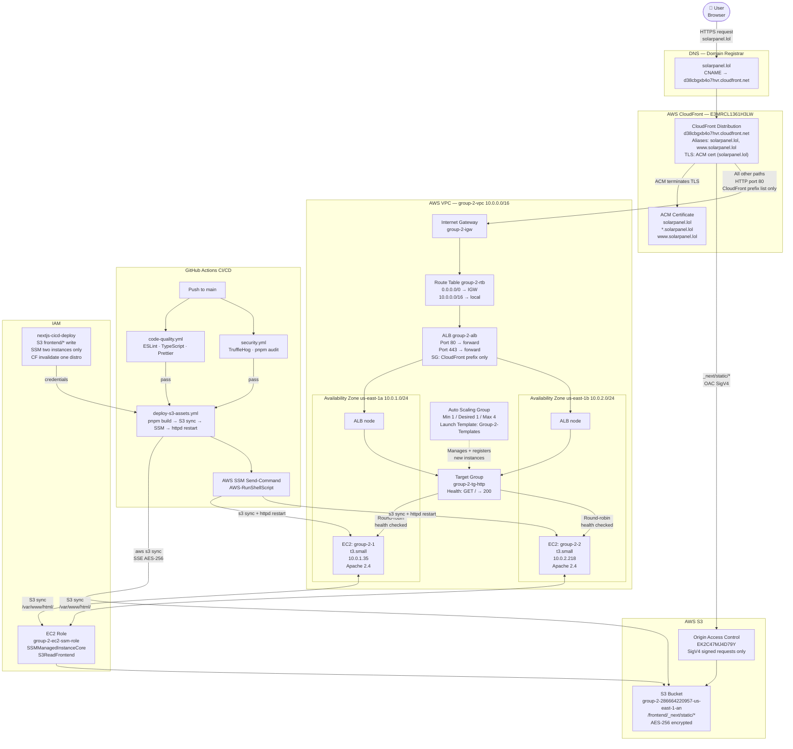

# Solar Technologies — Capstone Project

**Solar Technologies** is a smart farming platform that showcases autonomous solar-powered systems for agricultural monitoring, irrigation management, and precision analytics. Built as an Azubi Africa Cloud Engineering capstone project by Group 2.

> Live site: **[https://solarpanel.lol](https://solarpanel.lol)**

---

## What This Project Is

The application is a production-grade marketing and product site for a fictional solar-powered smart farming company. It demonstrates:

- A **Next.js 15 App Router** frontend with animated hero sections, product feature grids, testimonials, and a call-to-action — all built with Tailwind CSS and Framer Motion
- A **fully automated AWS infrastructure** including a custom VPC, multi-AZ EC2 deployment behind an Application Load Balancer, a CloudFront CDN with dual origins (S3 for static assets, ALB for HTML), ACM-issued SSL, and IAM least-privilege access controls
- A **four-stage CI/CD pipeline** using GitHub Actions that enforces code quality, security scanning, S3 asset upload, and rolling EC2 deployment on every merge to `main`

---

## Team — Group 2

| Name    | Role                      | AWS IAM User |
| ------- | ------------------------- | ------------ |
| Amartey | Cloud Architect / Lead    | `Amartey`    |
| Larry   | Cloud Architect           | `Larry`      |
| Loretta | Backend & DevOps Engineer | `Loretta`    |
| Akosa   | Frontend Engineer         | `Akosa`      |
| Bright  | Frontend Engineer         | `Bright`     |

---

## Architecture Diagram



---

## How Traffic Flows

Understanding how a browser request becomes a webpage helps explain why each AWS service exists:

1. **DNS** — The user types `solarpanel.lol`. Their browser queries DNS and receives a CNAME pointing to `d38cbgxb4o7hvr.cloudfront.net`. CloudFront's anycast network routes the request to the nearest edge location.

2. **CloudFront** — CloudFront holds the ACM TLS certificate and terminates HTTPS. The user never communicates directly with the ALB or EC2. CloudFront then decides which origin to fetch from based on the URL path:
   - `/_next/static/*` → **S3** (immutable assets, cached at the edge for 1 year)
   - Everything else → **ALB** (HTML, images, served fresh every request)

3. **S3 via OAC** — When fetching a JS or CSS bundle, CloudFront signs the request with SigV4 using the OAC. S3 validates the signature and confirms the request originates from the correct distribution before serving the file. The S3 bucket has no public access — only CloudFront can read `frontend/*`.

4. **ALB → EC2** — For HTML pages, CloudFront forwards the request over HTTP (port 80) to the ALB. The ALB's security group only accepts connections from CloudFront's origin-facing IP ranges (`pl-3b927c52`), blocking any direct browser-to-ALB access. The ALB round-robins requests between the two EC2 instances across `us-east-1a` and `us-east-1b`.

5. **Apache on EC2** — Apache serves the static Next.js HTML from `/var/www/html/`. The files were placed there by the last CI/CD deployment, synced from S3 via AWS SSM.

---

## How Deployments Work

When a developer merges a pull request to `main`:

```text
Code lands on main
        │
        ▼
┌───────────────────┐     ┌──────────────────────┐
│  code-quality.yml │     │    security.yml       │
│  • ESLint         │     │  • TruffleHog secrets │
│  • TypeScript     │     │  • pnpm audit --prod  │
│  • Prettier       │     │  • dependency-review  │
└────────┬──────────┘     └──────────┬───────────┘
         │  both pass                │
         └──────────────┬────────────┘
                        ▼
              deploy-s3-assets.yml
                        │
              ┌─────────▼──────────┐
              │   pnpm build       │
              │   next.js export   │
              │   → out/           │
              └─────────┬──────────┘
                        │
              ┌─────────▼──────────────────────────┐
              │   aws s3 sync out/_next/  (immutable)│
              │   aws s3 sync out/ (must-revalidate) │
              │   --sse AES256 --exact-timestamps    │
              └─────────┬──────────────────────────┘
                        │
              ┌─────────▼──────────────────────────┐
              │  SSM Send-Command → both EC2s      │
              │  aws s3 sync s3://bucket/frontend/ │
              │    /var/www/html/ --exact-timestamps│
              │  systemctl restart httpd            │
              └────────────────────────────────────┘
```

No CloudFront invalidation is needed. HTML is uploaded with `Cache-Control: max-age=0, must-revalidate` so CloudFront always fetches a fresh copy. JS/CSS filenames are content-hashed by Next.js so a changed file gets a new URL — old cached entries are never stale.

---

## Running Locally

**Prerequisites:** Node.js 20+, pnpm 10+

```bash
# 1. Clone the repository
git clone <repo-url>
cd Azubi_capstone_group2

# 2. Install dependencies
pnpm install

# 3. Start the development server
pnpm dev
```

Visit [http://localhost:3000](http://localhost:3000).

The dev server uses Next.js's built-in hot-reload. Changes to any file in `src/` are reflected immediately in the browser without a full refresh.

### Building for Production (static export)

```bash
pnpm build
```

This generates a fully static site in `out/`. You can serve it locally to verify the production build:

```bash
npx serve out/
```

### Code Quality

```bash
pnpm lint          # ESLint
pnpm type-check    # TypeScript (tsc --noEmit)
pnpm format        # Prettier check
pnpm format:fix    # Prettier auto-fix
```

---

## Infrastructure Documentation

Full documentation for every AWS service, IAM policy, and CI/CD workflow is in the [`docs/`](docs/) folder.

| Topic                                            | File                                                          |
| ------------------------------------------------ | ------------------------------------------------------------- |
| Architecture overview & service interconnections | [docs/README.md](docs/README.md)                              |
| VPC, Subnets, Route Tables, IGW                  | [docs/vpc-networking.md](docs/vpc-networking.md)              |
| Security Groups                                  | [docs/security-groups.md](docs/security-groups.md)            |
| EC2 Instances & Launch Template                  | [docs/ec2-instances.md](docs/ec2-instances.md)                |
| Auto Scaling Group                               | [docs/auto-scaling.md](docs/auto-scaling.md)                  |
| Target Group & ALB                               | [docs/alb-target-group.md](docs/alb-target-group.md)          |
| CloudFront Distribution                          | [docs/cloudfront.md](docs/cloudfront.md)                      |
| ACM Certificate                                  | [docs/acm.md](docs/acm.md)                                    |
| S3 Bucket & Policies                             | [docs/s3.md](docs/s3.md)                                      |
| IAM Users, Groups & Policies                     | [docs/iam.md](docs/iam.md)                                    |
| Codebase & CI/CD Workflow                        | [docs/codebase-workflow.md](docs/codebase-workflow.md)        |

---

## Tech Stack

| Layer           | Technology                             |
| --------------- | -------------------------------------- |
| Framework       | Next.js 15 (App Router, static export) |
| Language        | TypeScript 5                           |
| Styling         | Tailwind CSS 4                         |
| Animation       | Framer Motion                          |
| Package Manager | pnpm 10                                |
| CDN             | AWS CloudFront                         |
| Origin (HTML)   | AWS EC2 + Apache HTTPD 2.4             |
| Origin (Assets) | AWS S3 (OAC)                           |
| Load Balancer   | AWS Application Load Balancer          |
| TLS             | AWS ACM (auto-renewed)                 |
| CI/CD           | GitHub Actions                         |
| Secret Scanning | TruffleHog                             |
| Instance Access | AWS SSM Session Manager                |
