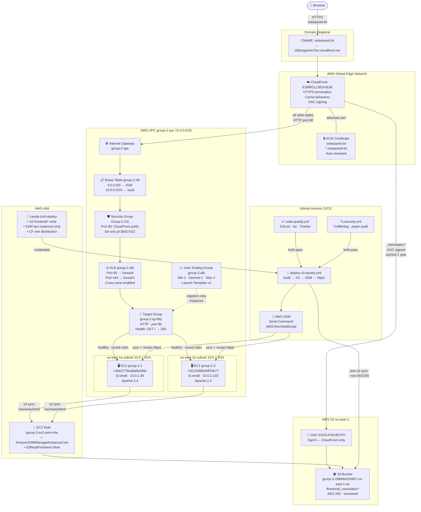

# Infrastructure Documentation — Solar Technologies

> AWS Region: `us-east-1` | Account: `286664220957` | Domain: `solarpanel.lol`

---

## Live Endpoints

| Endpoint        | URL                                                           |
| --------------- | ------------------------------------------------------------- |
| Production      | [https://solarpanel.lol](https://solarpanel.lol)              |
| WWW alias       | [https://www.solarpanel.lol](https://www.solarpanel.lol)      |
| ALB (internal)  | `group-2-alb-1333830676.us-east-1.elb.amazonaws.com`          |

---

## How Every Service Connects to the Others

The infrastructure is a chain of services where each layer depends on the one above it. Understanding why each service exists requires understanding what problem it solves for the layer that uses it.

### The Chain: Request → Response

```
Browser → DNS → CloudFront → [S3 or ALB] → EC2 → Apache → /var/www/html/
```

**DNS** is the entry point. Without a CNAME record pointing `solarpanel.lol` to CloudFront's domain, no browser would know where to send requests. DNS is managed at the domain registrar and is the only piece of infrastructure outside of AWS.

**ACM + CloudFront** work together to provide HTTPS. ACM issues a free TLS certificate for `solarpanel.lol` and `*.solarpanel.lol`. CloudFront is the only AWS service that can attach this certificate and terminate HTTPS connections from browsers. The EC2 instances never see HTTPS traffic — CloudFront handles all encryption.

**CloudFront routes to two origins** depending on the request path. This is the key architectural decision that makes the site both fast and correct:
- `/_next/static/*` goes to **S3** — these are content-hashed JS and CSS bundles that never change once deployed, so they can be cached for a full year at CloudFront's edge locations worldwide. Serving them from S3 also offloads bandwidth from EC2.
- Everything else goes to **ALB** — HTML pages that must always be fresh.

**OAC (Origin Access Control)** is what allows CloudFront to read from S3 privately. Without OAC, you would have to make the S3 bucket public — anyone with the S3 URL could read files, bypassing CloudFront's caching and potentially exposing files before they are intentionally published. OAC signs every request from CloudFront to S3 with AWS credentials, and the S3 bucket policy only allows requests that carry the correct distribution signature.

**The Security Group** is what connects CloudFront to the ALB securely. By restricting the ALB's port 80 to only the CloudFront origin-facing IP prefix list (`pl-3b927c52`), the ALB becomes unreachable from the public internet. A user cannot bypass CloudFront to hit the ALB directly. This means all traffic goes through CloudFront's TLS enforcement, caching, and (optionally) WAF.

**The ALB** connects to EC2 across two availability zones. If one AZ loses power or connectivity, the ALB automatically stops sending traffic to the instance in that AZ and the other instance handles all requests. This is multi-AZ high availability.

**The Target Group** is what the ALB uses to track which instances are healthy. It sends an HTTP `GET /` every 30 seconds to each instance. If an instance responds with 200, it stays in rotation. If it fails 3 times in a row, the ALB removes it. The target group is also what the Auto Scaling Group registers new instances into — the ASG and ALB communicate only through the target group.

**The VPC and Subnets** provide network isolation. All the resources above live inside the VPC's private address space (`10.0.0.0/16`). Resources in different VPCs (or in no VPC) cannot communicate with them unless explicitly allowed. The subnets split the VPC into two slices — one per AZ — and the route table connects both subnets to the internet gateway.

**EC2 and SSM** replace what would traditionally be a server you SSH into. The instances run Apache and serve static HTML. The SSM Agent (running on each instance) receives deployment commands from GitHub Actions via AWS's control plane, so no SSH port needs to be open. This removes an entire category of attack surface.

**S3 (as deployment store)** is the hub between the CI/CD pipeline and EC2. GitHub Actions builds the static site, uploads it to `s3://bucket/frontend/`, and then tells both EC2 instances (via SSM) to sync from that prefix to their `/var/www/html/`. S3 is the single source of truth for what content should be live — if you needed to add a third EC2 instance, you would simply run the same SSM sync command on it.

**IAM** is the permission layer that connects everything. Without the right IAM policies:
- GitHub Actions could not upload to S3 or send SSM commands
- EC2 instances could not read from S3 to sync files
- CloudFront could not read from S3 (OAC uses IAM signing)
- Team members could not manage their respective AWS resources

---

## Architecture Diagram



---

## Service Dependency Map

The table below shows which services each component directly depends on to function:

| Service | Depends On | Used By |
| ------- | ---------- | ------- |
| **DNS CNAME** | CloudFront domain name | Browser (entry point) |
| **ACM Certificate** | DNS validation records at registrar | CloudFront (TLS), ALB (HTTPS listener) |
| **CloudFront** | ACM cert, S3 OAC, ALB, DNS CNAME | Browser (all requests) |
| **OAC** | CloudFront distribution ID | S3 bucket policy condition |
| **S3 Bucket** | OAC, IAM roles (EC2 + CI/CD) | CloudFront (asset origin), EC2 (sync source), CI/CD (upload target) |
| **Internet Gateway** | VPC | Route table (default route) |
| **Route Table** | IGW | Both subnets |
| **Subnets** | VPC, Route table | ALB nodes, EC2 instances |
| **Security Group** | CloudFront prefix list `pl-3b927c52` | ALB (inbound), EC2 (inbound) |
| **ALB** | Security group, both subnets, target group | CloudFront (ALB origin) |
| **Target Group** | VPC, EC2 instances | ALB (routing decisions), ASG (registration) |
| **Auto Scaling Group** | Launch template, target group, subnets | Target group (registers new instances) |
| **EC2 Instances** | Security group, subnet, IAM instance profile | Target group (registered targets), SSM (receives commands) |
| **IAM EC2 Role** | S3 bucket policy, `AmazonSSMManagedInstanceCore` | EC2 instances (assume role), S3 reads |
| **SSM Agent** | IAM role with `AmazonSSMManagedInstanceCore` | GitHub Actions (`SendCommand`) |
| **IAM CI/CD User** | S3 bucket policy, SSM document + instance ARNs | GitHub Actions workflows |

---

## Documentation Index

| Topic | File | What You'll Learn |
| ----- | ---- | ----------------- |
| VPC, Subnets, Route Tables, IGW | [vpc-networking.md](vpc-networking.md) | Network topology, CIDR ranges, how traffic enters and exits the VPC |
| Security Groups | [security-groups.md](security-groups.md) | Why port 80 is restricted to CloudFront only, how to manage access |
| EC2 Instances & Launch Template | [ec2-instances.md](ec2-instances.md) | Instance specs, IAM role, Apache setup, SSM access |
| Auto Scaling Group | [auto-scaling.md](auto-scaling.md) | Self-healing behaviour, capacity settings, health check grace period |
| Target Group & ALB | [alb-target-group.md](alb-target-group.md) | Listener rules, health checks, round-robin routing |
| CloudFront Distribution | [cloudfront.md](cloudfront.md) | Dual-origin routing, OAC, cache behaviours, TLS configuration |
| ACM Certificate | [acm.md](acm.md) | SANs covered, DNS validation, auto-renewal, TLS policy |
| S3 Bucket & Policies | [s3.md](s3.md) | Bucket structure, cache headers, all four policy statements explained |
| IAM Users, Groups & Policies | [iam.md](iam.md) | Who can do what and why, least-privilege breakdown |
| Codebase & CI/CD Workflow | [codebase-workflow.md](codebase-workflow.md) | Next.js static export, all four workflows, deployment sequence |
